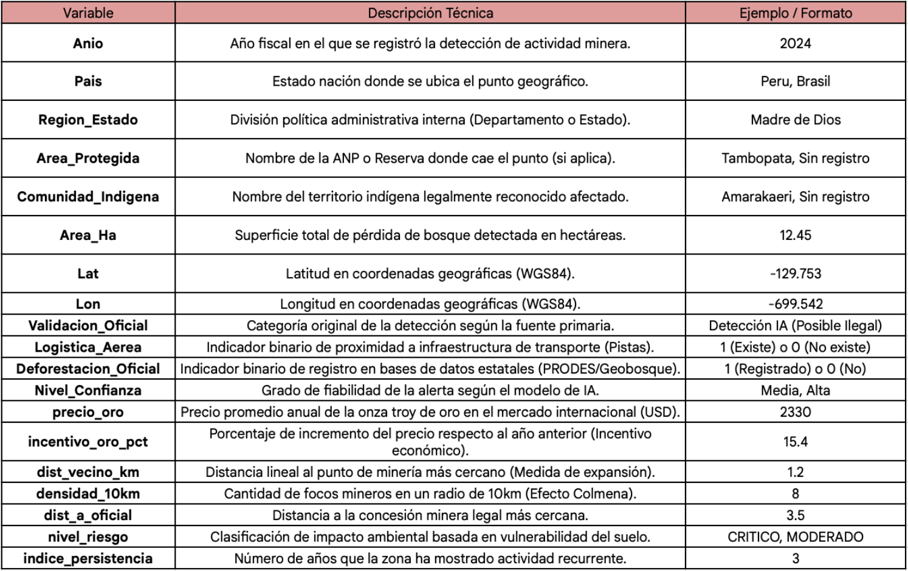

# Informe de proyecto

## Problematica: 
- La mineria ilegal y su expansion no planificada en la **Amazonia** (especificamente en la region transfronteriza del **Perú,Brazil,Venezuela,Bolivia y Guyanas**) representan una de las mas grandes amenazas para la biodiversidad y la integridad de los grupos indigenas que alli habitan, uno de los principales problemas es la **opaciodad de datos**: mientras que las mineras legales estan registradas, las opercaciones de pequeña escala aparecen y desaparecen a una velocidad que las entidades oficiales no pueden seguir.

- Teniendo como uno de los principales impulsores el aumento solstenido del precio del oro **(superando los $2,300 USD/oz en 2024)** lo que actua como un incentivo economico directo que combinado con la escasa regulacion y poco entendimiento o desentendimineto del problema, haciendo de esta una problematica creciente en la region **Pan-Amazonica**. 

## Objetivos del proyecto 

### ¿Que buscamos responder?

- Detección Temprana: ¿Dónde están apareciendo nuevas huellas de minería que aún no han sido reportadas por los gobiernos?

- Efecto Colmena (Clúster): ¿Existen patrones de agrupación donde una mina actúa como núcleo para la aparición de otras?

- Validación de Confianza: ¿Qué tan veraz es una detección de IA cuando se contrasta con la logística (pistas) y la deforestación oficial?

- Relación Económica: ¿Cómo influye el precio internacional del oro en la aparición de nuevos puntos de minería?


## Origen de los datos

- Los datos presentados en este proyecto provienen de una integracion de fuentes abiertas de todo tipo y tambien del analisis propio: 

    - **Detecciones IA**: Puntos identificados mediante modelos de visión por computadora sobre imágenes Sentinel y Planet.

    - **PRODES (Brasil)**: Datos oficiales de deforestacion del INPE para validacion y registro del territorio Brasileño. 

    - **Geobosques (Perú)**: Capas de pérdida de bosque del Programa Nacional de Conservación de Bosques.

    - **MapBiomas**: Inventario de minería consolidado para la Amazonía.

    - **SOS Orinoco**: Esperando una respuesta....


## Variables (Dataset)

### Evolución del Dataset (Genio1 y 2):

- La primera version de Genio se centro en la recopilacion de datos descriptivos y especiales basicos. En esta tabla representaremos la estructura de nuestros datos dentro del .csv **principales ya que representan la estructura fundacional para la integracion de metricas de densidad,distancia y economia.**


<p align="center">
  
</p>


- Nuturalmente puede surgir la pregunta del **Por qué?** se toman en cuenta algunas variables 

    - **Logistica_Aerea:** Hace referencia a que la minería en áreas remotas de la Amazonía es imposible sin logística aérea. La presencia de una pista de aterrizaje clandestina cerca de un foco de deforestación es el indicador más fuerte de minería ilegal activa. Al detectarla, descartamos que la deforestación sea por agricultura de subsistencia o causas naturales. 

    - Origen: Los datos de pistas provienen de la interpretación visual de imágenes de alta resolución y de bases de datos colaborativas como **RAISG.**

    - **Deforestacion Oficial:** Esta variable nos permite calificar los hallazgos en dos grupos: 

        - Confirmados: Aquellos que el gobierno ya tiene mapeados

         - Alertas Tempranas: Puntos donde nuestra IA detecta minería que el estado aún no ha registrado ("No registrado"). Aquí es donde Genio 1 aporta mayor valor como herramienta de vigilancia. 
    

### Genio2 
- Para la segunda version de nuestro dataset **Genio2** introducimos variables para cuantificar la veracidad y el impacto economico de la mineria ilegal. 

<p align="center">
  
</p>

### Incentivo Económico
-  Correlación con el Mercado del Oro

```python
oro_history = {
    2018: 1268, 2019: 1392, 2020: 1770, 
    2021: 1798, 2022: 1801, 2023: 1943, 2024: 2330
}
# Aplicación del precio según el año de reporte
df['precio_oro'] = df['Anio'].map(oro_history)

# Cálculo del ""incentivo"" (Variación porcentual respecto al año base)
df['incentivo_oro_pct'] = df['precio_oro'].pct_change() * 100
```
- Para entender por que es que aumenta la mineria en zonas especificas. **Genio2** integra el valor historico del oro desde el ***(2018-2019-2020-2021-2022-2023-2024)***; Esta variable permite modelar la presion economica dentro del ecosistema de la region: **a mayor precio por oz (onza), mayor es la probabilidad de nuevos frentes mineros**

### Análisis de Densidad 
- Efecto colmena 


```python
from scipy.spatial import cKDTree

# Algoritmo de proximidad para identificar clústeres
def calcular_efecto_colmena(df, radio_km=10):
    # Creamos un árbol de búsqueda espacial (KDTree)
    coords = df[['Lat', 'Lon']].values
    tree = cKDTree(coords)
    
    # Contamos cuántos puntos existen en el radio definido (Efecto Colmena)
    # Convertimos km a grados aproximados (1 grado ~ 111km)
    radio_grados = radio_km / 111.0
    df['densidad_10km'] = [len(tree.query_ball_point(p, radio_grados)) - 1 for p in coords]
    
    # Clasificación basada en densidad
    df['tipo_expansion'] = df['densidad_10km'].apply(
        lambda x: 'Frente Consolidado' if x > 5 else 'Evento Aislado'
    )
    return df
```
- La minería ilegal rara vez ocurre de forma aislada. El Efecto Colmena identifica clústeres o focos de expansión mediante el análisis de proximidad. Si una detección tiene múltiples vecinos en un radio de 10km, el sistema la clasifica como un Frente Minero Consolidado, esto tambien nos puede decir algo mas que eso, y es que si es que algo de mucho se agrupa en una locaciones significa que puede deberse a factores varios ejemplos (Logistica cercana, cantidad de mineral x metro cuadrado) esto tambien nos permitiria poder determinar que zonas de la amazonia estarian proximas a ser invadidas y afectadas por la mineria ilegal. 

### Variables de Evaluacion de riesgos: 
- Estas variables sirven de respuesta para poder determinar **peligrosidad y su historial de impunidad** de la mineria ilegal

### - Distancia a Minería Oficial
```python
# Cálculo de proximidad a polígonos oficiales
def calcular_distancia_a_legal(df, df_oficial):
    # Utilizamos cKDTree para encontrar el punto oficial más cercano
    tree_oficial = cKDTree(df_oficial[['Lat', 'Lon']].values)
    dist, _ = tree_oficial.query(df[['Lat', 'Lon']].values)
    
    # Convertimos la distancia de grados a metros/kilómetros
    df['dist_a_oficial'] = dist * 111.32 # Aproximación km
    return df
```
- Esta variable mide la separación entre una detección de la IA y la concesión legal más cercana registrada por el gobierno (ANM en Brasil o INGEMMET en Perú), siguiendo la logica **una distancia menor a 500m suele indicar que la mina legal se está "saliendo" de sus límites.** .

    - **Proposito:** Identificar si la actividad es una expansión ilegal de una mina permitida o una nueva invasión en territorio virgen.

### -Nivel de Riesgo
```python
# Clasificación de riesgo ambiental
def asignar_nivel_riesgo(row):
    if row['Area_Protegida'] != 'Sin registro':
        return 'CRÍTICO'
    elif row['Comunidad_Indigena'] != 'Sin registro':
        return 'ALTO'
    elif row['densidad_10km'] > 5:
        return 'MODERADO'
    else:
        return 'BAJO'

df['nivel_riesgo'] = df.apply(asignar_nivel_riesgo, axis=1)
```
- No todas las minas son igual de dañinas. El riesgo se calcula cruzando la ubicación del punto con capas de Áreas Protegidas y Comunidades Indígenas **es una variable categórica basada en la vulnerabilidad del territorio afectado.**

### -Índice de Persistencia

```python
# Cálculo de recurrencia temporal
def validar_persistencia_activa(df):
    # Ordenamos por año para comparar cronológicamente
    df = df.sort_values(['coord_key', 'Anio'])
    
    # Calculamos la diferencia de área entre años para el mismo punto
    df['crecimiento_ha'] = df.groupby('coord_key')['Area_Ha'].diff().fillna(0)
    
    # Solo consideramos "Persistencia Activa" si el hueco creció 
    # o si se detectó logística nueva (maquinaria/pistas)
    df['es_activa'] = (df['crecimiento_ha'] > 0.1) | (df['Logistica_Binaria'] == 1)
    
    # El índice real solo suma años donde hubo expansión
    df['indice_persistencia'] = df.groupby('coord_key')['es_activa'].cumsum()
    return df
```
- A diferencia de un análisis de cambio de cobertura simple, el indice_persistencia de Genio2 no mide la permanencia del "hueco", sino la continuidad de la perturbación. El algoritmo valida que exista un incremento en el Area_Ha o una alteración en la firma espectral del suelo (presencia de sedimentos nuevos) entre años consecutivos. Esto permite diferenciar entre una mina abandonada en proceso de regeneración y un frente de extracción activo que se expande agresivamente.

## Conclusión

El dataset Genio2 no es solo una lista de coordenadas; es una matriz de evidencia que permite priorizar esfuerzos de fiscalización. Al integrar el incentivo económico (precio del oro) con la realidad geográfica y la logística aérea, el modelo puede predecir qué zonas están en mayor riesgo de convertirse en frentes mineros consolidados.